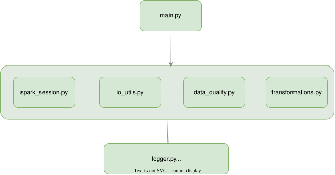
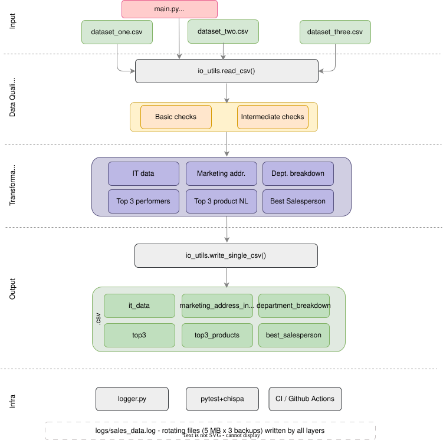
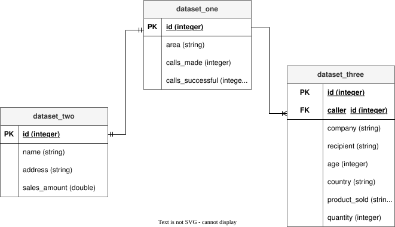

# EternalTeleSales Fran van Seb Group – PySpark Analytics Pipeline

A PySpark data engineering pipeline that ingests three CSV datasets from a telemarketing company, runs data quality checks, and produces six analytical outputs used by management and stakeholders.

---

## Architecture



## Pipeline Flow Diagram




```
┌─────────────────────────────────────────────────────────────────────┐
│                        LOCAL / VS CODE                              │
│                                                                     │
│  ┌────────────┐  ┌────────────┐  ┌─────────────┐                  │
│  │dataset_one │  │dataset_two │  │dataset_three│  ← CSV Inputs    │
│  │  .csv      │  │  .csv      │  │  .csv       │                  │
│  └─────┬──────┘  └─────┬──────┘  └──────┬──────┘                  │
│        │               │                │                          │
│        └───────────────┼────────────────┘                          │
│                        ▼                                            │
│              ┌──────────────────┐                                   │
│              │   io_utils.py    │  read_csv()                       │
│              │  (SparkSession)  │                                   │
│              └────────┬─────────┘                                   │
│                       │                                             │
│                       ▼                                             │
│              ┌──────────────────┐                                   │
│              │ data_quality.py  │                                   │
│              │                  │                                   │
│              │  Basic Checks:   │                                   │
│              │  • non-null IDs  │                                   │
│              │  • unique IDs    │                                   │
│              │  • row counts    │                                   │
│              │  • non-negative  │                                   │
│              │                  │                                   │
│              │  Intermediate:   │                                   │
│              │  • ref integrity │                                   │
│              │  • calls ≤ made  │                                   │
│              │  • address fmt   │                                   │
│              └────────┬─────────┘                                   │
│                       │  warnings / DataQualityError                │
│                       ▼                                             │
│              ┌──────────────────┐                                   │
│              │transformations.py│                                   │
│              │                  │                                   │
│              │ Output #1        │ → it_data/                        │
│              │ Output #2        │ → marketing_address_info/         │
│              │ Output #3        │ → department_breakdown/           │
│              │ Output #4        │ → top_3/                          │
│              │ Output #5        │ → top_3_most_sold_…_netherlands/  │
│              │ Output #6        │ → best_salesperson/               │
│              └──────────────────┘                                   │
│                                                                     │
│  logs/sales_data.log  ← rotating file log (5 MB × 3 backups)       │
└─────────────────────────────────────────────────────────────────────┘
```

---  

## Data Model




### Input Datasets

```
dataset_one.csv (1 000 rows)
┌──────────────────────┬─────────────┐
│ Column               │ Type        │
├──────────────────────┼─────────────┤
│ id (PK)              │ Integer     │
│ area                 │ String      │  e.g. IT, Marketing, Games
│ calls_made           │ Integer     │  ≥ 0
│ calls_successful     │ Integer     │  ≥ 0, ≤ calls_made
└──────────────────────┴─────────────┘

dataset_two.csv (1 000 rows)
┌──────────────────────┬─────────────┐
│ Column               │ Type        │
├──────────────────────┼─────────────┤
│ id (PK, FK→ds1.id)   │ Integer     │
│ name                 │ String      │
│ address              │ String      │  "[street], [num], [4d 2C]"
│ sales_amount         │ Double      │  ≥ 0
└──────────────────────┴─────────────┘

dataset_three.csv (10 000 rows)
┌──────────────────────┬─────────────┐
│ Column               │ Type        │
├──────────────────────┼─────────────┤
│ id (PK)              │ Integer     │
│ caller_id (FK→ds1.id)│ Integer     │
│ company              │ String      │
│ recipient            │ String      │
│ age                  │ Integer     │
│ country              │ String      │
│ product_sold         │ String      │
│ quantity             │ Integer     │  ≥ 0
└──────────────────────┴─────────────┘
```

### Relationships

```
dataset_one ─ (id = id) ─ dataset_two      [1-to-1]
dataset_one ─ (id = caller_id) ─ dataset_three  [1-to-many]
```

### Output Schemas

| Output directory                           | Key columns                                                  |
|--------------------------------------------|--------------------------------------------------------------|
| `it_data/`                                 | All ds1+ds2 columns, filtered IT, top 100 by sales_amount ↓ |
| `marketing_address_info/`                  | street_address, zip_code                                     |
| `department_breakdown/`                    | area, total_sales_amount, call_success_rate                  |
| `top_3/`                                   | area, name, success_rate_pct, sales_amount, rank             |
| `top_3_most_sold_per_department_netherlands/` | area, product_sold, total_quantity, rank                  |
| `best_salesperson/`                        | country, name, total_quantity                                |

---

## Project Structure

```
O1_ASSIGNMENT/
├── data/                          ← input CSVs (not committed to git)
│   ├── dataset_one.csv
│   ├── dataset_two.csv
│   └── dataset_three.csv
├── output/                        ← generated by pipeline (git-ignored)
├── logs/                          ← rotating log files (git-ignored)
├── src/
│   └── sales_data/
│       ├── __init__.py
│       ├── logger.py              ← rotating file + console logger
│       ├── spark_session.py       ← SparkSession factory
│       ├── io_utils.py            ← read_csv / write_single_csv
│       ├── data_quality.py        ← Basic + Intermediate DQ checks
│       ├── transformations.py     ← all 6 transformation functions
│       └── main.py                ← CLI entry point (sales-data)
├── tests/
│   ├── conftest.py                ← shared SparkSession fixture
│   ├── test_data_quality.py
│   └── test_transformations.py
├── .github/
│   └── workflows/ci.yml          ← GitHub Actions CI
├── .pre-commit-config.yaml
├── mypy.ini
├── setup.cfg
├── setup.py
└── requirements.txt
```

---

## Prerequisites

- Python 3.10
- Java 11 or 17 
- Git

---

## Local Setup (VS Code)

```bash
# 1. Clone / open the project folder in VS Code

# 2. Create a virtual environment
python3.10 -m venv .venv
source .venv/bin/activate          # Windows: .venv\Scripts\activate

# 3. Install all dependencies
pip install -r requirements.txt

# 4. Install the package in editable mode (enables 'sales-data' entry point)
pip install -e .

# 5. (Optional) Install pre-commit hooks
pre-commit install
```

> **Java note**: Set `JAVA_HOME` if PySpark cannot find Java:
> ```bash
> export JAVA_HOME=$(/usr/libexec/java_home -v 11)   # macOS
> ```

---

## Running the Pipeline

```bash
# From the project root with venv activated:
python -m sales_data.main \
    --ds1 data/dataset_one.csv \
    --ds2 data/dataset_two.csv \
    --ds3 data/dataset_three.csv \
    --output output

# Or via the entry point (after pip install -e .):
sales-data \
    --ds1 data/dataset_one.csv \
    --ds2 data/dataset_two.csv \
    --ds3 data/dataset_three.csv \
    --output output

# Halt execution if any DQ check fails:
sales-data ... --halt-on-failure

# Skip intermediate DQ checks:
sales-data ... --skip-intermediate
```

Outputs are written to `output/<output_name>/part-00000-*.csv`.

---

## Running the Tests

```bash
pytest tests/ -v
```

Tests use [chispa](https://github.com/MrPowers/chispa) for PySpark DataFrame equality assertions.

---

## Linting & Formatting

```bash
black src tests          # auto-format
isort src tests          # sort imports
flake8 src tests         # lint
mypy src                 # type check
```

---

## Packaging

```bash
python setup.py sdist    # creates dist/sales-data-1.0.0.tar.gz
```

---

## CI/CD

GitHub Actions runs on every push/PR:
1. isort check
2. black check
3. flake8
4. mypy
5. pytest

See `.github/workflows/ci.yml`.

---

## Bonus: Who should get the bonus? (Output #4 answer)

The top-3 performers per department are filtered to those with `calls_successful / calls_made > 75%`.
Among them, the employee with the **highest sales_amount** best combines efficiency (high success rate) with business impact (revenue generated). That person deserves the bonus most — success rate alone does not drive revenue, but the combination of both is the strongest signal of overall performance.
