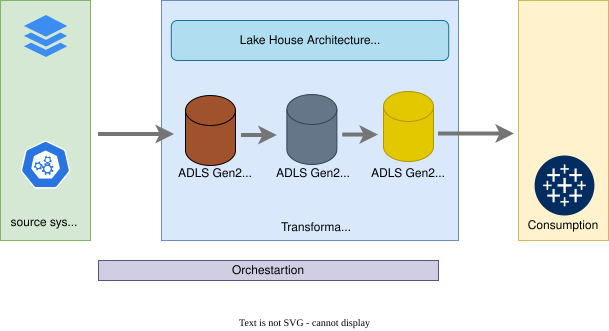
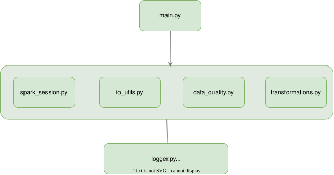
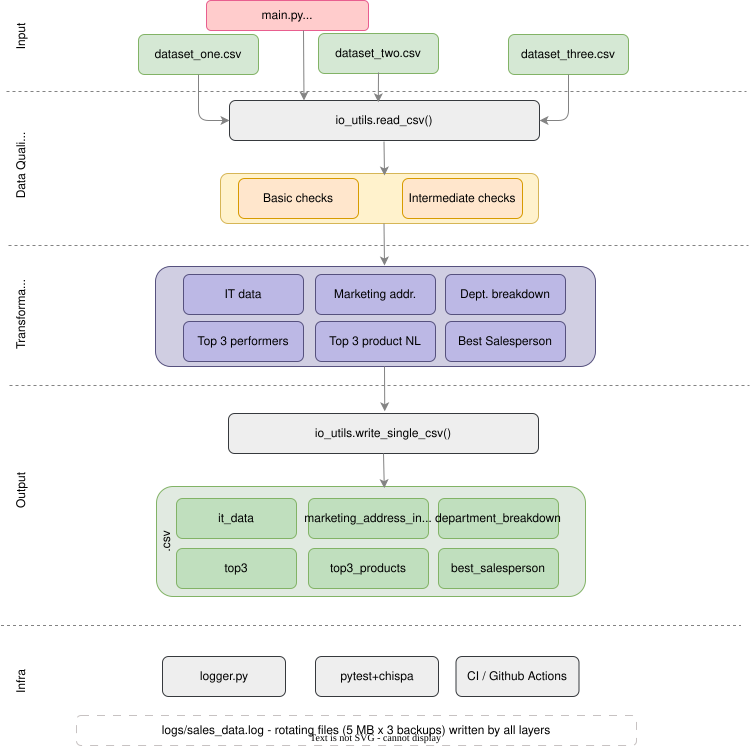
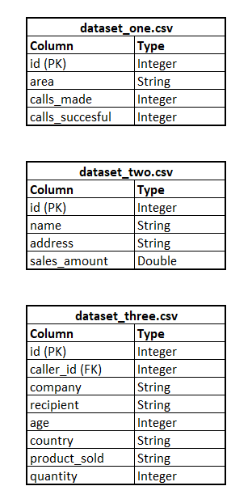
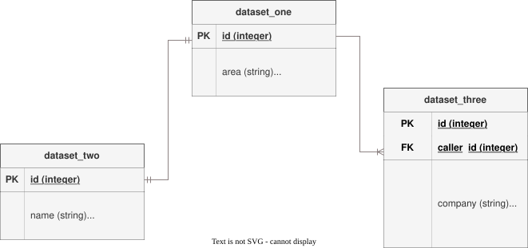
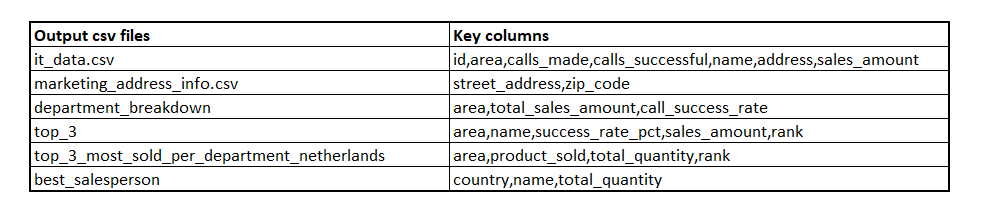

# EternalTeleSales Fran van Seb Group – PySpark Analytics Pipeline

A PySpark data engineering pipeline that ingests three CSV datasets from a telemarketing company, runs data quality checks, and produces six analytical outputs used by management and stakeholders.

---

## Architecture





## Pipeline Flow Diagram




### Input Datasets



## Data Model



### Relationships

```
dataset_one ─ (id = id) ─ dataset_two [1-to-1]
dataset_one ─ (id = caller_id) ─ dataset_three  [1-to-many]
```

### Output Schemas



## Project Structure

```
O1_ASSIGNMENT/
├── data/                          ← input CSVs (not committed to git)
│   ├── dataset_one.csv
│   ├── dataset_two.csv
│   └── dataset_three.csv
├── output/                        ← generated by pipeline (git-ignored)
├── logs/                          ← rotating log files (git-ignored)
├── src/
│   └── sales_data/
│       ├── __init__.py
│       ├── logger.py              ← rotating file + console logger
│       ├── spark_session.py       ← SparkSession factory
│       ├── io_utils.py            ← read_csv / write_single_csv
│       ├── data_quality.py        ← Basic + Intermediate DQ checks
│       ├── transformations.py     ← all 6 transformation functions
│       └── main.py                ← CLI entry point (sales-data)
├── tests/
│   ├── conftest.py                ← shared SparkSession fixture
│   ├── test_data_quality.py
│   └── test_transformations.py
├── .github/
│   └── workflows/ci.yml          ← GitHub Actions CI
├── .pre-commit-config.yaml
├── mypy.ini
├── setup.cfg
├── setup.py
└── requirements.txt
```

---

## Prerequisites

- Python 3.10
- Java 11 or 17
- Git
- Hadoop 3.3.5

---

## Local Setup (VS Code)

```bash
# 1. Clone / open the project folder in VS Code

# 2. Create a virtual environment
python3.10 -m venv .venv
source .venv/bin/activate          # Windows: .venv\Scripts\activate

# 3. Install all dependencies
pip install -r requirements.txt

# 4. Install the package in editable mode (enables 'sales-data' entry point)
pip install -e .

# 5. (Optional) Install pre-commit hooks
pre-commit install
```

> **Java note**: Set `JAVA_HOME` if PySpark cannot find Java:
> ```bash
> export JAVA_HOME=$(/usr/libexec/java_home -v 11)   # macOS
> ```

**Hadoop note**: Set `HADOOP_HOME` if output files are not generated
https://github.com/cdarlint/winutils download hadoop-3.3.5/bin
---

## Running the Pipeline

```bash
# From the project root with venv activated:
python -m sales_data.main \
    --ds1 data/dataset_one.csv \
    --ds2 data/dataset_two.csv \
    --ds3 data/dataset_three.csv \
    --output output

# Or via the entry point (after pip install -e .):
sales-data \
    --ds1 data/dataset_one.csv \
    --ds2 data/dataset_two.csv \
    --ds3 data/dataset_three.csv \
    --output output

# Halt execution if any DQ check fails:
sales-data ... --halt-on-failure

# Skip intermediate DQ checks:
sales-data ... --skip-intermediate
```

Outputs are written to output `output/<output_name>/part-00000-*.csv`.
Outputs are written to output folder with specified output name `output/<output_name>/<output_name>.csv`.

---

## Running the Tests

```bash
pytest tests/ -v
```

Tests use [chispa](https://github.com/MrPowers/chispa) for PySpark DataFrame equality assertions.

---

## Linting & Formatting

```bash
black src tests          # auto-format
isort src tests          # sort imports
flake8 src tests         # lint
mypy src                 # type check
```

---

## Packaging

```bash
python setup.py sdist    # creates dist/sales-data-1.0.0.tar.gz
```

---

## CI/CD

GitHub Actions runs on every push/PR:
1. isort check
2. black check
3. flake8
4. mypy
5. pytest

See `.github/workflows/ci.yml`.

---
## Requirement

### Output #1 - **IT Data**

The management teams wants some specific information about the people that are working in selling IT products.

- Join the two datasets.
- Filter the data on the **IT** department.
- Order the data by the sales amount, biggest should come first.
- Save only the first **100** records.
- The output directory should be called **it_data** and you must use PySpark to save only to one **CSV** file.

### Output #2 - **Marketing Address Information**

The management team wants to send some presents to team members that are work only selling **Marketing** products and wants a list of only addresses and zip code, but the zip code needs to be in it's own column.

- The output directory should be called **marketing_address_info** and you must use PySpark to save only to one **CSV** file.

### Output #3 - **Department Breakdown**

The stakeholders want to have a breakdown of the sales amount of each department and they also want to see the total percentage of calls_succesfful/calls_made per department. The amount of money and percentage should be easily readable.

- The output directory should be called **department_breakdown** and you must use PySpark to save only to one **CSV** file.

### Output #4 - **Top 3 best performers per department**

The management team wants to reward it's best employees with a bonus and therefore it wants to know the name of the top 3 best performers per department. That is the ones that have a percentage of calls_succesfful/calls_made higher than 75%. It also wants to know the sales amount of these employees to see who best deserves the bonus. In your opinion, who should get it and why?

- The output directory should be called **top_3** and you must use PySpark to save only to one **CSV** file.
## Bonus: Who should get the bonus? (Output #4 answer)

The top-3 performers per department are filtered to those with `calls_successful / calls_made > 75%`.
Among them, the employee with the **highest sales_amount** best combines efficiency (high success rate) with business impact (revenue generated). That person deserves the bonus most — success rate alone does not drive revenue, but the combination of both is the strongest signal of overall performance.

### Output #5 - **Top 3 most sold products per department in the Netherlands**

- The output directory should be called **top_3_most_sold_per_department_netherlands** and you must use PySpark to save only to one **CSV** file.

### Output #6 - **Who is the best overall salesperson per country**

- The output directory should be called **best_salesperson** and you must use PySpark to save only to one **CSV** file.
